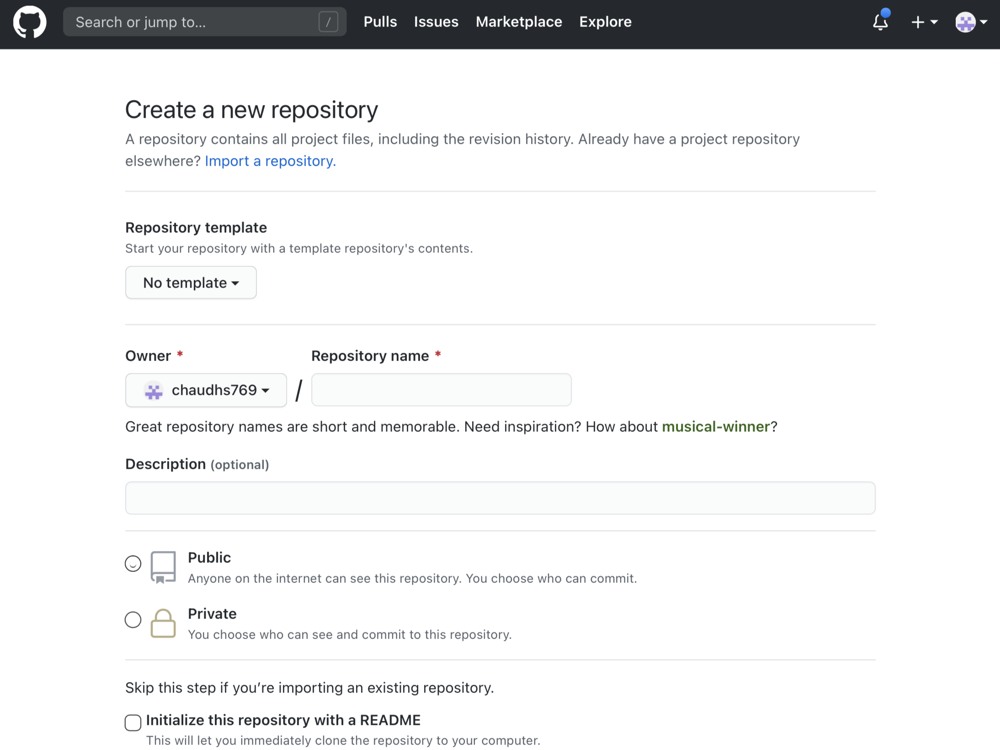

# Export
1. Click Publish, and then publish to local Drive. Enter that path (such as `/Users/Yourusername/Foldername` where you want to save it. If you enter an unrecognised path, mobirise will create that folder for you.

2. Initialise a new github repository at https://github.com/new

3. Open terminal on mac or linux/git bash on windows and clone github repo url. `git clone (URL of github repo.git)`
4. Move files from where you published site in mobirise to your locally cloned github repo.
5. Run `cd clonedrepofolder.git` in your terminal/git bash with clonedrepofolder being where you cloned your github repository.
6. Run `git add --all` after this. This makes all your files ready to commit.
7. Run `git commit -m"yourmessage" && git push` replacing yourmessage with anything you want
